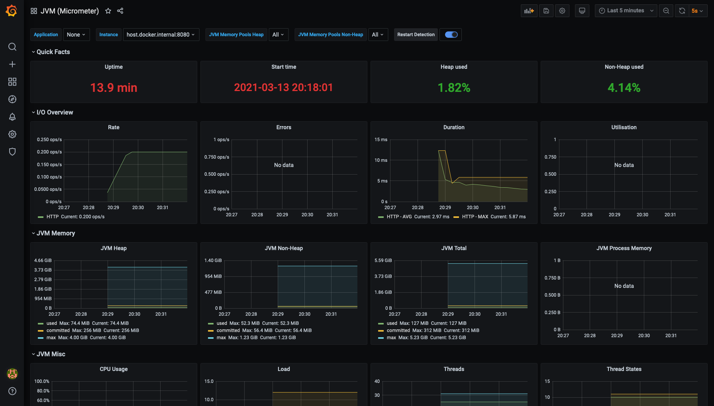
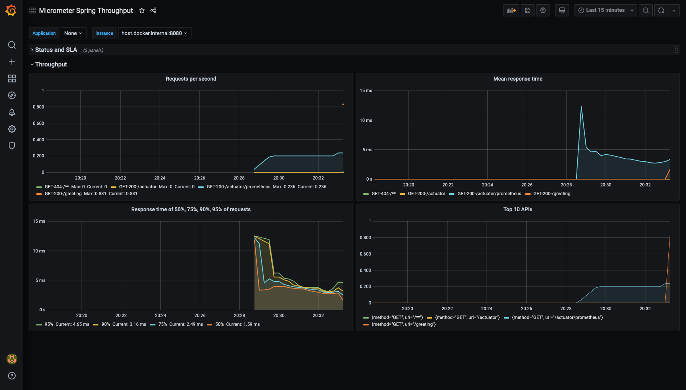

# How to collect metrics from Spring Boot application with micrometer prometheus and grafana full guide

## Preconditions:
1. __Maven__, but you can adapt it for gradle too.
2. __Docker__ and __docker-compose__, prometheus and grafana will be used as containers.
3. __Spring boot 2__ and higher by default, [but it was backported for 1.3-1.5 with dependencies](https://spring.io/blog/2018/03/16/micrometer-spring-boot-2-s-new-application-metrics-collector#what-is-it).
4. __IDEA__ or any different ide

[Since Spring boot 2 __Micrometer__ is default metric collector](https://spring.io/blog/2018/03/16/micrometer-spring-boot-2-s-new-application-metrics-collector). 
And it is simple to expose metrics of application through new actuator approach. It is neccesary to just add metric provider and read them. Here we will use [__Prometheus__](https://prometheus.io/) as metric collector. 

I will use sample application as an example. All the source code will be available on github.

## Init spring boot 2 via spring initializr [optional]
Sample application can be created via spring initializr and it required to add dependencies for start.
```xml
        <dependency>
            <groupId>org.springframework.boot</groupId>
            <artifactId>spring-boot-starter-web</artifactId>
        </dependency>
```

## Setup actuator
[Spring boot provides a mechanism which is used for service of application](https://docs.spring.io/spring-boot/docs/current/reference/html/production-ready-features.html).
Firstly, add the dependency for actuator
```xml
        <dependency>
            <groupId>org.springframework.boot</groupId>
            <artifactId>spring-boot-starter-actuator</artifactId>
        </dependency>
```
By default actuator is available on __port__=8080 __uri__=/actuator"

So, sample app actuator is available on uri=__localhost:8080/actuator__

We can visit this page and see sample actuator json answer. Now actuator is working and we are ready to supply metrics.
```json
{
   "_links":{
      "self":{
         "href":"http://localhost:8080/actuator",
         "templated":false
      },
      "health-path":{
         "href":"http://localhost:8080/actuator/health/{*path}",
         "templated":true
      },
      "health":{
         "href":"http://localhost:8080/actuator/health",
         "templated":false
      },
      "info":{
         "href":"http://localhost:8080/actuator/info",
         "templated":false
      }
   }
}
```

## Metrics collection enable
Micrometer is included default distribution, so you only need to metric export to prometheus, just add a dependency for it.
```xml
        <dependency>
            <groupId>io.micrometer</groupId>
            <artifactId>micrometer-registry-prometheus</artifactId>
        </dependency>
```
Next we configure `application.yml` to provide metrics from application.
By default `prometheus` endpoint is disabled and we need to activate it.
Here is sample config.
```yml
management:
  endpoints:
    web:
      exposure:
        include: health,prometheus
  metrics:
    export:
      prometheus:
        enabled: true
    distribution:
      percentiles-histogram:
        "[http.server.requests]": true
```
I opened two endpoints `health` and `prometheus`, moreover enabled metrics collection for prometheus and `distribution.percentiles-histogram.http.server.requests` will watch for endpoint performance and response codes. Also micrometer by default shows jvm metrics, so if we now launch application at `http://localhost:8080/actuator/prometheus` we will see jvm metrics and request ditribution (It will be printed after first api request).
```
jvm_memory_used_bytes{area="nonheap",id="Compressed Class Space",} 5166496.0
jvm_memory_used_bytes{area="nonheap",id="CodeHeap 'non-profiled nmethods'",} 6184704.0
# HELP tomcat_sessions_active_current_sessions  
# TYPE tomcat_sessions_active_current_sessions gauge
tomcat_sessions_active_current_sessions 0.0
# HELP jvm_buffer_memory_used_bytes An estimate of the memory that the Java virtual machine is using for this buffer pool
# TYPE jvm_buffer_memory_used_bytes gauge
jvm_buffer_memory_used_bytes{id="mapped",} 0.0
jvm_buffer_memory_used_bytes{id="direct",} 16384.0
# HELP process_start_time_seconds Start time of the process since unix epoch.
# TYPE process_start_time_seconds gauge
process_start_time_seconds 1.615646733726E9
# HELP system_cpu_usage The "recent cpu usage" for the whole system
# TYPE system_cpu_usage gauge
system_cpu_usage 0.0
# HELP process_cpu_usage The "recent cpu usage" for the Java Virtual Machine process
# TYPE process_cpu_usage gauge
process_cpu_usage 0.0
# HELP jvm_classes_unloaded_classes_total The total number of classes unloaded since the Java virtual machine has started execution
# TYPE jvm_classes_unloaded_classes_total counter
jvm_classes_unloaded_classes_total 0.0
# HELP jvm_gc_max_data_size_bytes Max size of long-lived heap memory pool
# TYPE jvm_gc_max_data_size_bytes gauge
jvm_gc_max_data_size_bytes 4.294967296E9
# HELP http_server_requests_seconds  
# TYPE http_server_requests_seconds histogram
http_server_requests_seconds_bucket{exception="None",method="GET",outcome="SUCCESS",status="200",uri="/actuator",le="0.002446676",} 0.0
http_server_requests_seconds_bucket{exception="None",method="GET",outcome="SUCCESS",status="200",uri="/actuator",le="0.002796201",} 0.0
http_server_requests_seconds_bucket{exception="None",method="GET",outcome="SUCCESS",status="200",uri="/actuator",le="0.003145726",} 0.0
http_server_requests_seconds_bucket{exception="None",method="GET",outcome="SUCCESS",status="200",uri="/actuator",le="0.003495251",} 0.0
http_server_requests_seconds_bucket{exception="None",method="GET",outcome="SUCCESS",status="200",uri="/actuator",le="0.003844776",} 0.0
```

## Monitoring environment
Sample `docker-compose.yml` for prometheus and grafana. 
```yml
version: '3.7'

services:
  grafana:
    build: './config/grafana'
    ports:
      - 3000:3000
    volumes:
      - ./grafana:/var/lib/grafana
    environment:
      - GF_SECURITY_ADMIN_USER=admin
      - GF_SECURITY_ADMIN_PASSWORD=admin
    networks:
      monitoring:
        aliases:
          - grafana
  prometheus:
    image: prom/prometheus
    ports:
      - 9090:9090
    volumes:
      - ./config/prometheus.yml:/etc/prometheus/prometheus.yml
      - ./prometheus:/prometheus
    networks:
      monitoring:
        aliases:
          - prometheus
networks:
  monitoring:
```
__As you can see grafana container is builded__. It is grafana bug with preconfigured dashboards. I preconfigured sample dashboards for grafana. [See more in source repo](https://github.com/Kirya522/medium-posts/tree/main/spring-metrics)
Make sure to configure `prometheus.yml` for your url.
Sample
```yml
scrape_configs:
  - job_name: 'sample_monitoring'
    scrape_interval: 5s
    metrics_path: '/actuator/prometheus'
    static_configs:
      - targets: ['host.docker.internal:8080']
```

I have prepared two diffirent dashboards
1. JVM
2. Responses

### Dashboards
Result dashboard for jvm




## Links

[Github repo with sample](https://github.com/Kirya522/medium-posts/tree/main/spring-metrics)

